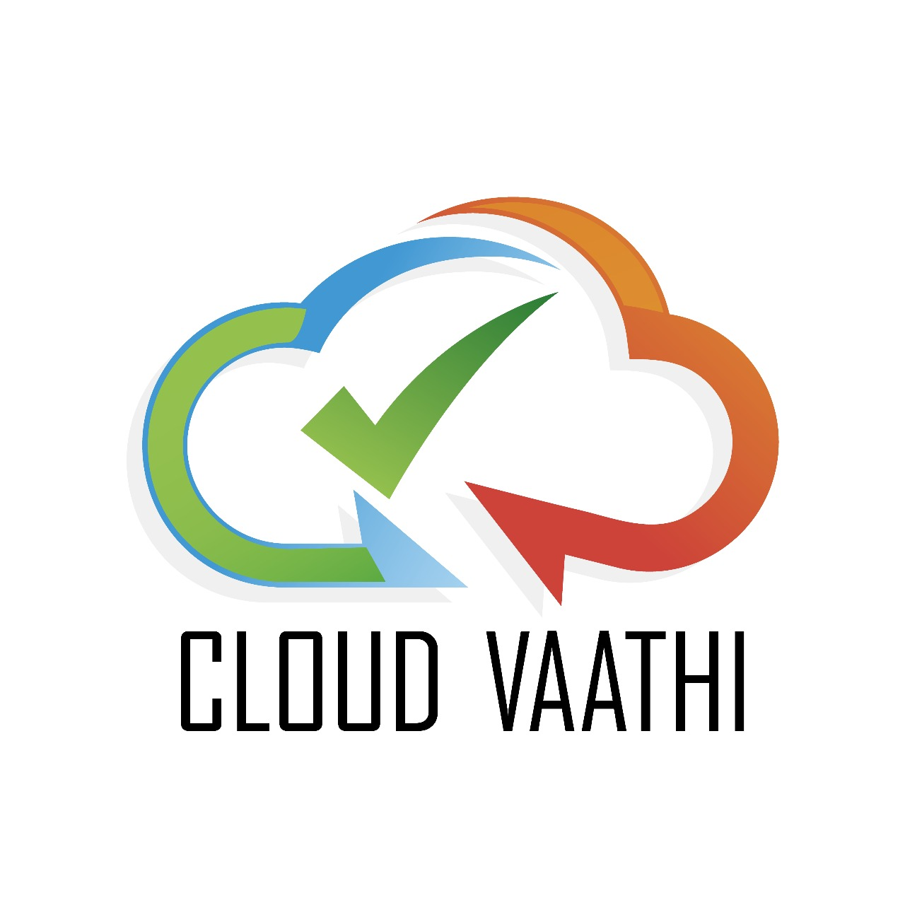

  

<h3 align="center">Crafting The Cyber Capital Of The World”</h3>

<i> CloudVaathi • Director – Training at ISACA Chennai • Strategic Trainer</i>

---

## 🎓 My Learning Vault: Categorized by Domain

For any one on one Guidance on Cyber, Certification or Career : [Sivva @ Topmate](https://topmate.io/sivva_k/)

Essential Materials for Preparation
| Course Title | Link |
|--------------|------|
| THINK LIKE A MANAGER - YOUR ULTIMATE KEY TO CLEAR CHALLENGING CERITIFCATIONS | [Watch the Video](https://www.youtube.com/watch?v=fGziJ958T-E) |
| Cloud 1 to 5 Mindmap | [Read Here](https://mm.tt/map/2668147739?t=PVMY3zMD6y)|

---

### ☁️ Cloud Security - CCSKV5

| Course Title | Link |
|--------------|------|
| Cloudvaathi's CCSKV5 Ultimate Exam Cram -The One Video to Clear the CCSK Exam | [Watch the Video](https://www.youtube.com/watch?v=q4Ko5RinGGo) |
| CCSKV5 Ultimate Exam Cram PDF | [Read Here](https://l1nq.com/CCSKpdf)|
| CCSKV5 - 720 Practice Qns -Your Sure Shot To Exam Success!! | [View Course](https://www.udemy.com/course/ccskv5exam-720-practice-questions-your-sure-shot-to-exam-success/?couponCode=FADACED9C9AE3EDF3207)|

---

### 🤖 Artificial Intelligence 

| Course Title | Link |
|--------------|------|
| Azure AI Fundamentals Mindmap | [Read Here](https://mm.tt/map/3142337600?t=DRvAbM6qkL)|
| Master Azure AI (AI-900):The Ultimate 300-Qn Practice Bank | [View Course](https://www.udemy.com/course/master-azure-ai-ai-900the-ultimate-300-qn-practice-bank-r/?couponCode=849E4A6D33364B3C6E61)|
| Crack AWS AI Practitioner: 325 Qns for Guaranteed Success!! | [View Course](https://www.udemy.com/course/crack-aws-ai-practitioner-325-qns-for-guaranteed-success-z/?couponCode=92E5A46C24ADB6340F95)|

---

### 🛡️ Zero Trust Architecture (Zt)

Courses and resources focused on implementing and understanding Zero Trust principles across cloud and enterprise environments

| Course Title | Link |
|--------------|------|
| CCZT 360º : Your Essential Practice Kit for Exam Mastery | [View Course](https://www.udemy.com/course/cczt-360o-your-essential-practice-kit-for-exam-mastery/?couponCode=DC7334E94563C39CEC0B)|

---

### 🏛️ Enterprise Architecture & TOGAF

Courses and resources focused on mastering EA frameworks, TOGAF principles, and strategic alignment of IT with business goals.

| Course Title | Link |
|--------------|------|
| TOGAF Mindmap| [View Course](https://mm.tt/map/3687304525?t=ZQ5rliC3Fc)|
| EA Edge : Elevate Your Exam readiness with 320 Practice Qns | [View Course](https://www.udemy.com/course/ea-edge-elevate-your-exam-readiness-with-320-practice-qns/?couponCode=FFBC44F664E6EA6A0EDF)|

### ☁️ Cloud Security - ISC2 CCSP

| Course Title | Link |
|--------------|------|
| Conquer ISC2 CCSP with 750+ Consolidated Practice Questions | [View Course](https://www.udemy.com/course/conquer-isc2-ccsp-with-750-consolidated-practice-questions/?couponCode=BC92E08BD3FBCB5916EC) |
| Dominate the CCSP Domains : 900+ Targeted Practice Questions | [View Course](https://www.udemy.com/course/dominate-the-ccsp-domains-900-targeted-practice-questions/?couponCode=D4915F820BB9D03BBAF6)|

---

## 📺 Instructor Led Bootcamps & Master class 

Ready to grow in your career by mastering the Emerging Technology with real-world scenarios?

Our bootcamps are built for impact — fast-paced, focused, and certification-ready with proven results

📩 Contact us at _cloudvaathi@gmail.com_ to learn more !!

## 📺 Bootcamps List 

  ### ☁️ Cloud Administrator
  
  ### 🔐 Cloud Security
  
  ### 🤖 Artificial Intelligence
  
  ### 🧠 Prompt Engineering & Generative AI
  
  ### 🧭 CISM – Information Security Management
  
  ### 🛡️ CCSP – Cloud Security Certification
  
  ### 🧪 Selenium – Test Automation
  
  ### 🏛️ TOGAF & Enterprise Architecture 
  
  ### ⚙️ DevOps & CI/CD

---

## 📌 How to Use This Repo
- Clone or fork this repo to track your own progress.
- Add notes or completion status next to each course.
- Share with peers or learners to inspire their journey.

---

<i>“Wishing all the best for your learning journy ! Let's together craft the Cyber capital of the world”</i>
  
